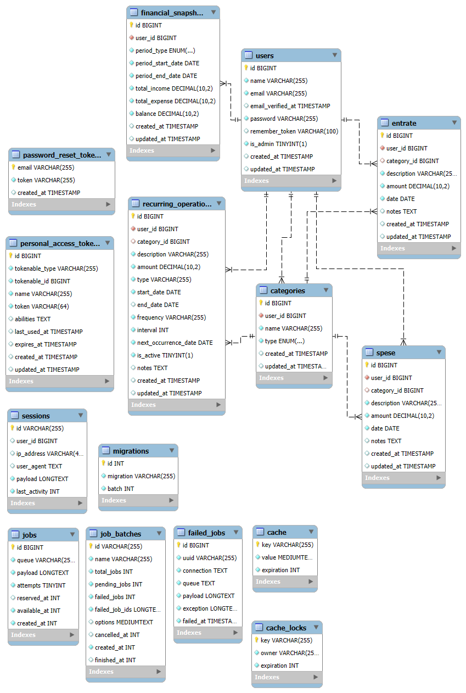

# 🧰 Laravel Developer CheatSheet

Questa è una raccolta sintetica di comandi, pratiche e convenzioni utili per lo sviluppo e la manutenzione del progetto Laravel.  
Include comandi per Artisan, testing, debugging, migrations, sessioni, moduli personalizzati e altro.

---

## 📁 Ambiente di sviluppo

| Comando                            | Descrizione                                                                         |
| ---------------------------------- | ----------------------------------------------------------------------------------- |
| php artisan serve                  | Avvia il server di sviluppo locale ([http://127.0.0.1:8000](http://127.0.0.1:8000)) |
| npm run dev                        | Avvia Vite per il build frontend con hot-reload                                     |
| npm run dev-full                   | Avvia Vite, server Laravel su porta 8484 e queue worker                             |
| php artisan migrate                | Applica tutte le migrations nel DB configurato                                      |
| php artisan migrate:fresh --seed  | Ricrea il DB da zero ed esegue i seeder                                             |
| php artisan db:seed                | Esegue i seeder definiti                                                            |
| php artisan route:list             | Mostra tutte le rotte del progetto                                                  |
| php artisan storage:link           | Crea link simbolico per public/storage, utile per file caricati                     |

---

## ♻️ Comandi di pulizia

| Comando                      | Descrizione                             |
| ---------------------------- | --------------------------------------- |
| php artisan config:clear     | Pulisce la cache di configurazione      |
| php artisan route:clear      | Pulisce la cache delle rotte generate   |
| php artisan cache:clear      | Pulisce la cache dell'applicazione      |
| php artisan view:clear       | Pulisce le view compilate da Blade      |
| php artisan optimize:clear   | Pulisce tutte le cache in un colpo solo |

---

## 🧩 Comandi Artisan personalizzati

| Comando                                     | Descrizione                                                                  |
|--------------------------------------------|------------------------------------------------------------------------------|
| php artisan routes:export-api-json         | Esporta tutte le rotte API in un file `routes-api.json` separato per modulo |
| php artisan routes:export-api-markdown     | Esporta tutte le rotte API in formato Markdown                              |
| php artisan make:custom-controller Nome    | Genera un controller base nel modulo corrente                               |
| php artisan make:custom-service-provider X | Genera uno scheletro per un ServiceProvider custom                          |
| php artisan make:custom-service Nome       | Crea un service dedicato in un modulo Laravel                               |
| php artisan make:custom-api-test Nome      | Crea uno scheletro di Feature Test per API                                  |
| php artisan make:custom-migration-test Nome| Crea un test per verificare le migrations di un modulo                      |
| php artisan make:custom-module-json Nome   | Genera la struttura base di un modulo (cartelle, config, test, ecc.)        |

> ℹ️ I comandi `make:custom-*` sono pensati per **standardizzare e velocizzare** la creazione di codice modulare nel progetto.

---

## ✅ Comandi Artisan per test

| Comando                              | Descrizione                                                     |
| ------------------------------------ | --------------------------------------------------------------- |
| php artisan test                     | Esegue tutti i test (Feature e Unit)                            |
| php artisan test --filter=NomeTest   | Esegue solo la classe/metodo specificato                        |
| php artisan test --parallel          | Esegue i test in parallelo (più veloce; utile per grandi suite) |
| php artisan test --coverage          | Mostra la copertura del codice (richiede Xdebug abilitato)      |

> ℹ️ **Installazione Xdebug**: usa `pecl install xdebug` oppure installalo con il tuo package manager (es. Homebrew, apt). Verifica con `php -v`.

---

## 🧪 Struttura test consigliata

| Percorso file                          | Contenuto                                                         |
| -------------------------------------- | ----------------------------------------------------------------- |
| tests/Feature/Auth/...Test.php         | Test funzionali per login, registrazione, reset password          |
| tests/Feature/ProfileTest.php          | Test aggiornamento profilo e cancellazione account                |
| Modules/NomeModulo/tests/Feature/...   | Test delle API per ciascun modulo (es. Entrate, Spese, Categorie) |
| tests/Unit/...                         | Test unitari: modelli, helpers, logica isolata                    |

---

## 🧠 Helpers Laravel nei test

| Helper                                     | Spiegazione                                  |
| ------------------------------------------ | -------------------------------------------- |
| $this->actingAs($user)                     | Simula un utente autenticato                 |
| $this->assertAuthenticatedAs($user)        | Verifica che l'utente sia autenticato        |
| $this->assertGuest()                       | Verifica che nessun utente sia autenticato   |
| $this->withSession([...])                  | Simula una sessione con valori specifici     |
| $this->get() / post() / put() / delete()   | Simula una richiesta HTTP                    |
| $response->assertRedirect()                | Verifica che la risposta sia un redirect     |
| $response->assertSessionHasErrors()        | Verifica che la sessione contenga errori     |
| $response->assertSessionHasNoErrors()      | Verifica che la sessione non contenga errori |
| $response->assertOk()                      | Verifica che la risposta HTTP sia 200 OK     |

> ℹ️ Questa sezione serve per capire come verificare **i comportamenti** dell'applicazione nei test.

---
## 🧬 Schema ER del Database

Ecco lo schema entità-relazioni dell'applicazione Synapsy:




---
## ⚙️ Configurazioni test

- Non è usato `.env.testing`
- I test sono configurati per usare **SQLite in memoria** (`phpunit.xml`):

```xml
<env name="DB_CONNECTION" value="sqlite"/>
<env name="DB_DATABASE" value=":memory:"/>
```

---
## 🧪 Code Coverage (Copertura del Codice)

- Per generare un report visivo della copertura dei test, puoi usare il seguente comando:

 php artisan test --coverage-html coverage
 📂 Questo comando:
Esegue tutti i test automatici del progetto.

Genera una cartella coverage/ con un report HTML della code coverage.

Puoi aprire il file coverage/index.html nel browser per vedere quali file e righe di codice sono coperte dai test (verde = coperto, rosso = non coperto).

ℹ️ Questo è utile per migliorare la qualità del codice e identificare rapidamente le parti non testate.

Nota: la cartella coverage/ è locale e non dovrebbe essere committata nel repository. È già inclusa nel .gitignore.


---
## ✅ Best practices per test

- Usa sezioni ben commentate nei test:

```php
// ================================================================
// SEZIONE: LOGIN
// ================================================================
```

- Evita test sulle migration che dipendono da MySQL (es. indici, `SHOW INDEXES`)
- Prediligi Feature test realistici (API, form, redirect)

---

## 📂 Struttura sintetica del progetto

| Percorso              | Descrizione                                             |
|-----------------------|---------------------------------------------------------|
| `app/`                | Logica principale dell'app (Models, Services, Http)     |
| `Modules/`            | Moduli funzionali isolati (es. Categories, Entrate)     |
| `routes/`             | File rotte web/api                                      |
| `resources/views/`    | Blade templates (frontend lato server)                  |
| `public/`             | Entry point web e asset pubblici                        |
| `config/`             | Configurazioni Laravel                                  |
| `storage/`            | File generati/cachati dal runtime                       |
| `tests/`              | Directory dei test (Feature, Unit)                      |
| `database/`           | Migrations e Seeders                                    |

---

Pronto per lavorare, testare e mantenere con ordine. ✅
