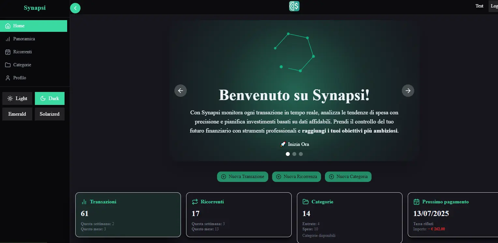

# 🚀 Synapsy Finance — Fullstack Monorepo

Gestione avanzata di entrate, spese e operazioni ricorrenti.

**🚀 Prova ora Synapsy!**

---

## 📚 Indice

-   [📦 Backend API](Backend/docs/README.md)
-   [💻 Frontend Web](Frontend-nextjs/docs/README.md)
-   [🗺️ Site Structure](Frontend-nextjs/docs/SITE_STRUCTURE.md)

---

## 🛠️ Requisiti minimi

-   PHP 8.2+
-   Node.js 20+
-   PostgreSQL (oppure SQLite per i test)

---

## ⚡ Avvio rapido

```bash
git clone https://github.com/davide017017/Synapsy.git
cd Synapsy
```

### Backend

```bash
cd Backend
composer install
cp .env.example .env
php artisan migrate --seed
php artisan serve
```

### Frontend

```bash
cd Frontend-nextjs
npm install
cp .env.example .env
npm run dev
```

---

## 🔗 Demo online

👉 **Prova subito la web app qui:**  
[https://synapsy-frontend.vercel.app/](https://synapsy-frontend.vercel.app/)

> Puoi accedere in modalità demo per esplorare tutte le funzionalità senza registrazione!

<br/>



---

## 🔒 Protezione utente demo

Le operazioni di scrittura sono bloccate per l'utente demo tramite un middleware centralizzato (`PreventDemoUserModification`) applicato a rotte API, web e auth. La UI mostra un avviso e disabilita i controlli di modifica (tema, avatar, eliminazione account). Feature introdotta nel commit `426d9c0`.

---

## 📄 Licenza

Distribuito sotto licenza MIT. Vedi [LICENSE](LICENSE).
